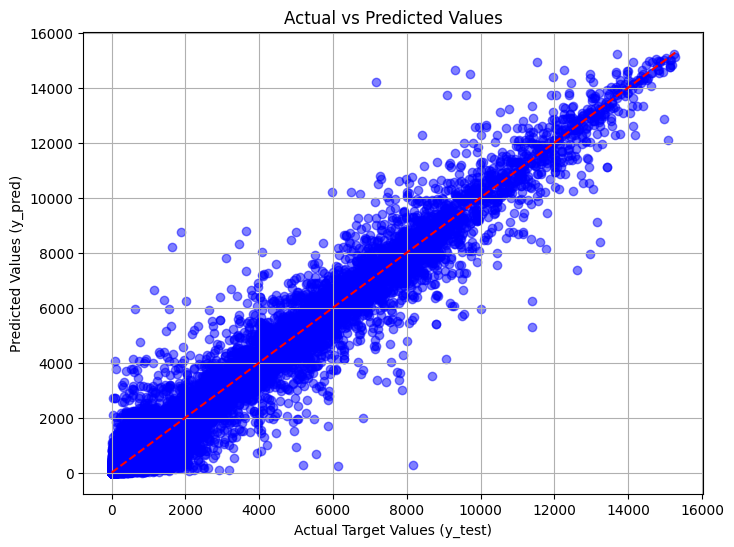

## Description

The number of prosumers is rapidly increasing, and solving the problems of energy imbalance and their rising costs is vital. If left unaddressed, this could lead to increased operational costs, potential grid instability, and inefficient use of energy resources. If this problem were effectively solved, it would significantly reduce the imbalance costs, improve the reliability of the grid, and make the integration of prosumers into the energy system more efficient and sustainable. Moreover, it could potentially incentivize more consumers to become prosumers, knowing that their energy behavior can be adequately managed, thus promoting renewable energy production and use.

## Evaluation

Submissions are evaluated on the Mean Absolute Error (MAE) between the predicted return and the observed target.

## Model Output

#### Considering the size of the dataset (1.05 GB), it is not uploaded in this repo. You can check the dataset [here](https://www.kaggle.com/competitions/predict-energy-behavior-of-prosumers/data)

## Next Steps
1. Define functions for data pre-processing (df mergers), model building and evaluation.
